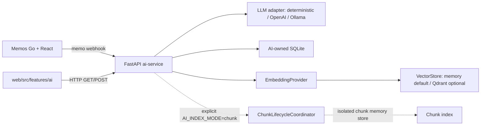

# DevMemo AI Architecture

更新时间：2026-07-14

## Boundary

Memos remains the source of truth for Memo content, tags, search and permissions. The AI service owns only derived summaries, templates, outbox state and optional vector indexes. The Webhook path avoids a core Memos fork while still reacting to create/update/delete events.

## Data model

AI Service SQLite currently contains:

`ai_notes`:

- `id`
- `memo_id`
- `summary`
- `keywords` (JSON array text)
- `category`
- `embedding_id` (兼容保留字段；完整 Memo 索引使用 `memo-v1` 派生 ID)
- `created_at`

`memo_templates` stores parsed Code Snippet/Bug Report payloads and original Markdown. `webhook_events` and `webhook_cleanup_audits` implement outbox/retry/retention audit. `memo_chunk_index_state` stores only `memo_id`, `index_version`, chunk ID JSON and timestamps for optional chunk lifecycle cleanup.

## Upgrade strategy

The repository keeps the official Memos remote as `upstream` and pins the initial baseline to `v0.29.1`. Upgrades should be performed one upstream tag at a time, with Memos tests and AI service tests run after each merge.

The default indexing boundary is `MemoIndexDocument`: one complete Memo is passed to the configured provider and VectorStore with `index_version=memo-v1`. Phase 5d adds an explicit `AI_INDEX_ON_WEBHOOK=true` + `AI_INDEX_MODE=chunk` path using `MemoChunk` and `memo-chunk-v1`; it uses a separate in-memory chunk store so the existing complete-Memo chat path is not contaminated.

The public `POST /api/ai/chat` contract remains complete-Memo oriented. A future Qdrant chunk collection and chunk-aware public retrieval contract require a separate phase.
