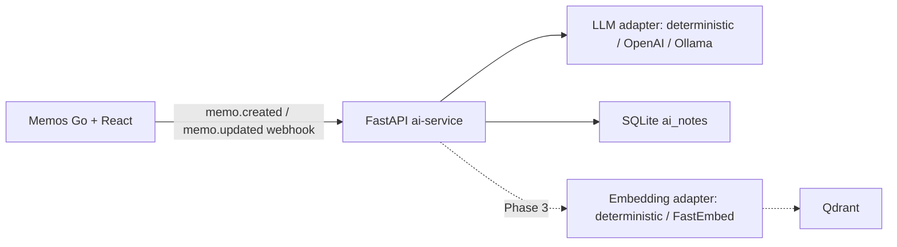

# Architecture

## Boundary

Memos remains the source of truth for Memo content. The AI service owns derived metadata and can be upgraded independently. The current webhook path avoids a core Memos fork while still triggering on create/update events.

## Data model

`ai_notes` currently contains:

- `id`
- `memo_id`
- `summary`
- `keywords` (JSON array text)
- `category`
- `embedding_id` (reserved for Phase 3)
- `created_at`

## Upgrade strategy

The repository keeps the official Memos remote as `upstream` and pins the initial baseline to `v0.29.1`. Upgrades should be performed one upstream tag at a time, with Memos tests and AI service tests run after each merge.

Phase 3c uses `MemoIndexDocument` as the indexing boundary. It currently passes
one complete Memo to the configured provider and VectorStore; chunking and
retrieval remain outside this slice.
