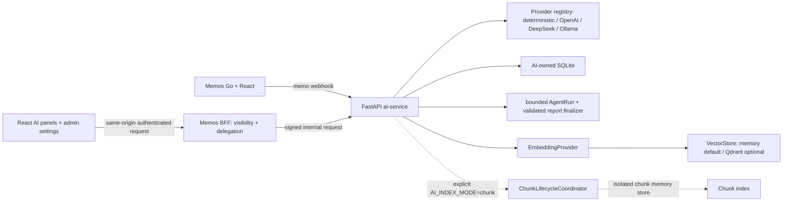

# DevMemo AI Architecture

更新时间：2026-10-01。当前范围/证据见 [项目状态](project-status.zh-CN.md)，
文件职责见 [结构](structure.md)。本文描述实际组合关系，不以历史切片替代当前实现。

## Boundary

```mermaid
flowchart LR
    M["Memos Go + React"] -->|"memo webhook"| A["FastAPI ai-service"]
    F["React AI panels + admin settings"] -->|"same-origin authenticated request"| B["Memos BFF: visibility + delegation"]
    B -->|"signed internal request"| A
    A --> L["Provider registry: deterministic / OpenAI / DeepSeek / Ollama"]
    A --> D["AI-owned SQLite"]
    A --> R["bounded AgentRun + validated report finalizer"]
    A --> E["EmbeddingProvider"]
    E --> V["VectorStore: memory default / Qdrant optional"]
    A -. explicit AI_INDEX_MODE=chunk .-> C["ChunkLifecycleCoordinator"]
    C -. isolated chunk memory store .-> V2["Chunk index"]
```

Memos remains the source of truth for Memo content, tags, search and permissions. The AI service owns only derived summaries, templates, outbox state and optional vector indexes. The Webhook path avoids a core Memos fork while still reacting to create/update/delete events.

## Data model

AI Service SQLite currently contains:

`ai_notes`:

- `id`
- `memo_id`
- `summary`
- `keywords` (JSON array text)
- `category`
- `embedding_id` (兼容保留字段；完整 Memo 索引使用 `memo-v1` 派生 ID)
- `created_at`

`memo_templates` stores parsed Code Snippet/Bug Report payloads and original Markdown. `webhook_events` and `webhook_cleanup_audits` implement outbox/retry/retention audit. `memo_chunk_index_state` stores only `memo_id`, `index_version`, chunk ID JSON and timestamps for optional chunk lifecycle cleanup.

Separate adapters own AgentRun metadata, derived Markdown artifacts, lifecycle
ledger and encrypted Provider configuration. Run metadata does not store raw
prompts/secrets. Configured keys are AES-GCM-encrypted with a separately supplied
master key; public reads return masked state. These are derived/configuration
stores, not a replacement for Memos source/permission authority.

## Upgrade strategy

The repository keeps the official Memos remote as `upstream` and pins the initial baseline to `v0.29.1`. Upgrades should be performed one upstream tag at a time, with Memos tests and AI service tests run after each merge.

The default indexing boundary is `MemoIndexDocument`: one complete Memo is passed to the configured provider and VectorStore with `index_version=memo-v1`. Phase 5d adds an explicit `AI_INDEX_ON_WEBHOOK=true` + `AI_INDEX_MODE=chunk` path using `MemoChunk` and `memo-chunk-v1`; it uses a separate in-memory chunk store so the existing complete-Memo chat path is not contaminated.

The service `POST /api/ai/chat` contract remains complete-Memo oriented. Optional
chunk Qdrant composition exists in a separate collection/version; it does not
replace complete-Memo Agent retrieval. Public chunk retrieval stays disabled
unless the trusted-gateway/visibility requirements are met.

`GET /api/ai/index/chunk-health` is a read-only operational view for the explicit chunk path. It compares isolated VectorStore `point_count` with SQLite lifecycle `tracked_memos`/`tracked_chunks`; it does not mutate indexes or expose Markdown.

## Evidence Answer and durable retrieval boundary

The experimental Evidence Answer browser entry calls only the authenticated
Memos BFF. Memos owns caller identity and visible complete-Memo scope; AI Service
accepts only the signed, bounded `memo-v1` capability and returns server-owned
citations plus a redacted trace. The feature remains disabled by default.

A4/R5 have opt-in single-host composition connecting source mutation/outbox,
derived ledger/vector state and current-authority rehydration. Memos issues
bounded authority and rechecks visibility/revisions; AI materializes content in
request memory. The feature remains default-disabled and is not multi-instance proof.

AgentRun synchronously executes fixed `project_summary` with creator-owned
artifact access. A consented configured Provider may finalize the strict report;
failure/timeout/invalid output produces an explicitly marked deterministic fallback.
Evidence Answer instead fails closed on Provider error. Provider deadlines are
20 seconds, relevant execution/test BFF budgets 25 seconds, metadata 10 seconds.
Legacy summary/chat retain environment settings. No worker, write-back or approval flow is added.

The Windows executable embeds production Web and Memos core, not AI Service or
models. Broader deployment and real-Provider quality remain optional independent
lanes. Current priorities are in the [Agent roadmap](agent-development-roadmap.md).
